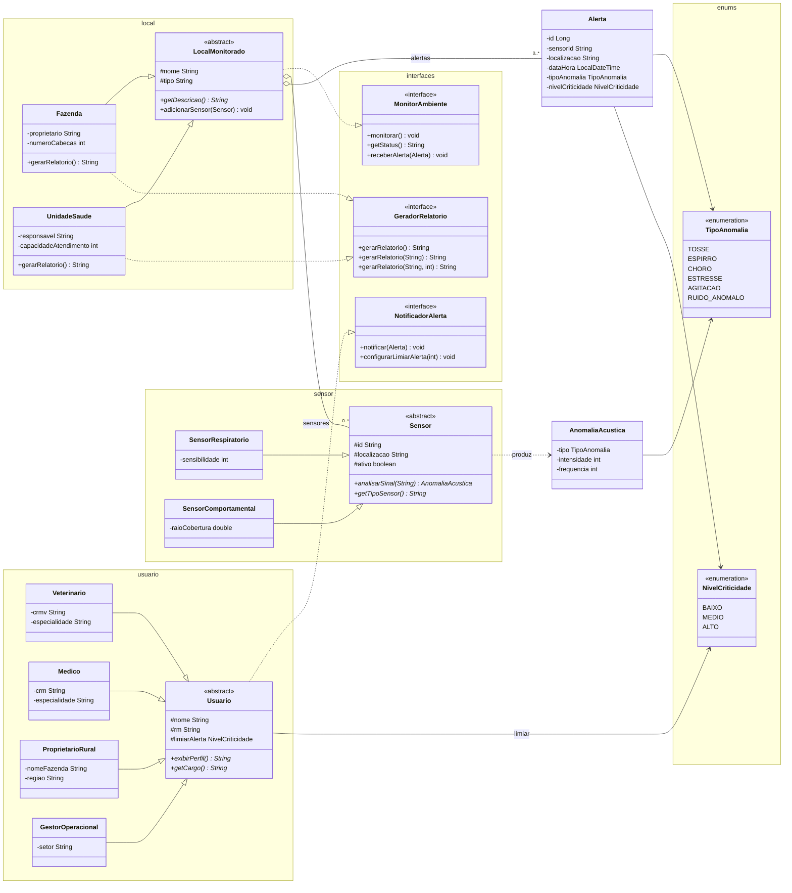

<p align="center">
  
</p>

# EchoVita — Monitoramento Acústico Preventivo

Aplicação Java de console para a GS FIAP. Monitora ambientes rurais e de saúde por meio de sensores acústicos, detecta anomalias sonoras, gera alertas por criticidade e notifica perfis operacionais conforme limiar configurado.

Sem framework e sem gerenciador de dependências — apenas Java puro.

## Arquitetura em camadas

```
br.com.echovita
├── Main.java                 → ponto de entrada
└── domain/                   → modelo de domínio
    ├── alerta/
    │   ├── Alerta            → alerta preventivo com criticidade
    │   └── AnomaliaAcustica  → resultado da análise de sinal
    ├── enums/
    │   ├── TipoAnomalia      → tosse, estresse, ruído anômalo, etc.
    │   └── NivelCriticidade  → baixo, médio, alto
    ├── interfaces/
    │   ├── GeradorRelatorio  → relatórios com filtro e limite
    │   ├── MonitorAmbiente   → monitoramento e recebimento de alertas
    │   └── NotificadorAlerta → notificação e limiar de alerta
    ├── local/
    │   ├── LocalMonitorado   → classe abstrata (herança)
    │   ├── Fazenda           → ambiente rural / saúde animal
    │   └── UnidadeSaude      → clínica ou unidade pública
    ├── sensor/
    │   ├── Sensor            → classe abstrata (herança)
    │   ├── SensorRespiratorio
    │   └── SensorComportamental
    └── usuario/
        ├── Usuario           → classe abstrata (herança)
        ├── Veterinario
        ├── Medico
        ├── ProprietarioRural
        └── GestorOperacional
```

### Responsabilidades

| Pacote | Responsabilidade |
|--------|------------------|
| `domain.alerta` | Representação de anomalias detectadas e alertas gerados |
| `domain.enums` | Tipos de anomalia acústica e níveis de criticidade |
| `domain.interfaces` | Contratos de monitoramento, relatório e notificação |
| `domain.local` | Ambientes monitorados, sensores associados e relatórios |
| `domain.sensor` | Captação e análise polimórfica de sinais sonoros |
| `domain.usuario` | Perfis que recebem alertas conforme limiar configurado |

## Diagrama de classes



## Java (SDKMAN)

O arquivo [`.sdkmanrc`](.sdkmanrc) fixa o JDK deste projeto. Com [SDKMAN](https://sdkman.io/) instalado, na raiz do repositório:

```bash
sdk env
java -version
```

Se essa distribuição ainda não estiver instalada:

```bash
sdk install java 21.0.2-open
sdk env
```

Requisito: **Java 21.0.2-open**

## Como executar

```bash
sdk env
mkdir -p out
find src -name "*.java" -print0 | xargs -0 javac --release 21 -d out -encoding UTF-8
java -cp out br.com.echovita.Main
```

Ou abra o projeto na IDE com **source root** em `src` e execute `br.com.echovita.Main`.

## Recursos orientados a objetos

- **Entidades de domínio**: `Alerta`, `AnomaliaAcustica`, `LocalMonitorado` (abstrata), `Sensor` (abstrata) e `Usuario` (abstrata)
- **Herança e polimorfismo**: `Fazenda` e `UnidadeSaude` estendem `LocalMonitorado`; `SensorRespiratorio` e `SensorComportamental` estendem `Sensor` com `@Override` em `analisarSinal()` e `getTipoSensor()`
- **Perfis de usuário**: `Veterinario`, `Medico`, `ProprietarioRural` e `GestorOperacional` especializam `Usuario` com `exibirPerfil()` e `getCargo()`
- **Interfaces**: `MonitorAmbiente` ← `LocalMonitorado`; `GeradorRelatorio` ← `Fazenda` / `UnidadeSaude`; `NotificadorAlerta` ← `Usuario`
- **Enums**: `TipoAnomalia` e `NivelCriticidade` para classificação de eventos e priorização
- **Composição**: `LocalMonitorado` agrega listas de `Sensor` e `Alerta`; sensores produzem `AnomaliaAcustica` que alimentam a criação de `Alerta`

## Funcionalidades de negócio

- **Análise acústica**: sensores interpretam sinais sonoros e classificam o tipo de anomalia (ex.: tosse, estresse, agitação)
- **Alertas preventivos**: `Alerta` registra sensor, local, tipo de anomalia, criticidade e data/hora
- **Monitoramento de ambiente**: locais recebem alertas e expõem status conforme sensores cadastrados
- **Notificação por limiar**: usuários configuram criticidade mínima (`configurarLimiarAlerta`) antes de receber alertas
- **Relatórios**: `Fazenda` e `UnidadeSaude` geram relatórios completos, filtrados por texto ou limitados por quantidade

## Exemplo de fluxo

1. Instancie um ambiente monitorado (`Fazenda` ou `UnidadeSaude`)
2. Cadastre sensores (`SensorRespiratorio`, `SensorComportamental`) no local via `adicionarSensor`
3. Analise um sinal com `analisarSinal("tosse repetida")` ou `analisarSinal("estresse no curral")`
4. Crie um `Alerta` a partir da anomalia detectada e registre no local com `receberAlerta`
5. Notifique um perfil (`Veterinario`, `Medico`, etc.) com `notificar(alerta)` respeitando o limiar
6. Gere relatório do ambiente com `gerarRelatorio()`, `gerarRelatorio("tosse")` ou `gerarRelatorio("tosse", 5)`

## Perguntas discursivas

### 1. Onde a herança foi utilizada e por que faz sentido?

Três hierarquias independentes:

- **`Sensor` (abstrata) → `SensorRespiratorio`, `SensorComportamental`**
  Todos os sensores compartilham `id`, `localizacao` e `ativo`, além dos métodos `ativar()` / `desativar()`. O que muda entre eles é a lógica de `analisarSinal()` e o `getTipoSensor()` — por isso são abstratos e cada subclasse os especializa.

- **`LocalMonitorado` (abstrata) → `Fazenda`, `UnidadeSaude`**
  Ambos os ambientes gerenciam listas de `Sensor` e `Alerta` e executam o ciclo de monitoramento (`monitorar()`). A diferença está na descrição e nas informações de negócio específicas (proprietário/cabeças vs. responsável/capacidade), isoladas em `getDescricao()`.

- **`Usuario` (abstrata) → `Veterinario`, `Medico`, `ProprietarioRural`, `GestorOperacional`**
  Toda a lógica de limiar de alerta, vinculação a locais e acúmulo de notificações vive em `Usuario`. Cada subclasse especializa apenas o que é profissionalmente distinto: `getCargo()` e `exibirPerfil()`.

A herança faz sentido porque elimina duplicação de lógica compartilhada e expressa relações "é um" reais do domínio (um `Veterinario` é um `Usuario`; uma `Fazenda` é um `LocalMonitorado`).

### 2. Qual foi a diferença entre a interface e a classe abstrata utilizadas no projeto?

| Critério | Classe abstrata | Interface |
|---|---|---|
| Representa | O que algo **é** | O que algo **pode fazer** |
| Possui estado | Sim (campos com valor) | Não |
| Implementação parcial | Sim | Não (apenas contratos) |
| Herança múltipla | Não | Sim |

No projeto:

- **Classes abstratas** (`Sensor`, `LocalMonitorado`, `Usuario`) carregam **estado** (ex.: `List<Alerta>` em `LocalMonitorado`, `NivelCriticidade limiarAlerta` em `Usuario`) e implementam comportamento concreto que todas as subclasses reutilizam.
- **Interfaces** (`MonitorAmbiente`, `GeradorRelatorio`, `NotificadorAlerta`) definem **contratos de comportamento** sem estado. `GeradorRelatorio`, por exemplo, é implementada tanto por `Fazenda` quanto por `UnidadeSaude` — classes que já pertencem à hierarquia de `LocalMonitorado`. Sem interface, não seria possível garantir esse contrato de forma desacoplada.

### 3. Onde ocorreu sobrescrita de métodos?

Todos acompanham a annotation `@Override`:

- `SensorRespiratorio` e `SensorComportamental` sobrescrevem `analisarSinal(String)` e `getTipoSensor()` de `Sensor`
- `Fazenda` e `UnidadeSaude` sobrescrevem `getDescricao()` de `LocalMonitorado` e os três `gerarRelatorio` de `GeradorRelatorio`
- `LocalMonitorado` sobrescreve `monitorar()`, `receberAlerta(Alerta)` e `getStatus()` de `MonitorAmbiente`
- `Veterinario`, `Medico`, `ProprietarioRural` e `GestorOperacional` sobrescrevem `getCargo()` e `exibirPerfil()` de `Usuario`
- `Usuario` sobrescreve `notificar(Alerta)` e `configurarLimiarAlerta(int)` de `NotificadorAlerta`
- Todas as classes sobrescrevem `toString()` herdado de `Object`

### 4. Onde ocorreu sobrecarga de métodos?

A interface `GeradorRelatorio` define três assinaturas com o mesmo nome:

```java
String gerarRelatorio();                       // todos os alertas
String gerarRelatorio(String filtro);          // filtra por tipo de anomalia
String gerarRelatorio(String filtro, int limite); // filtra e limita quantidade
```

`Fazenda` e `UnidadeSaude` implementam as três versões. Isso permite que o chamador escolha o nível de detalhe sem precisar de métodos com nomes diferentes.

### 5. Como esse projeto poderia evoluir futuramente para uma aplicação maior?

- **Persistência**: substituir os dados demo por banco de dados relacional (ex.: SQLite ou PostgreSQL) para histórico de alertas e configurações por usuário
- **API REST**: expor os casos de uso via Spring Boot, permitindo que apps mobile e dashboards web consumam os dados em tempo real
- **Novos tipos de sensor**: sensores de temperatura, umidade e vibração, adicionados como novas subclasses de `Sensor` sem alterar o código existente (aberto para extensão, fechado para modificação)
- **Notificação real**: integração com WhatsApp Business API e SMTP para envio efetivo de alertas, substituindo a simulação atual
- **Análise preditiva**: módulo de machine learning treinado com padrões acústicos históricos para antecipar doenças antes de manifestações visíveis
- **Multitenancy**: suporte a múltiplas organizações (fazendas distintas ou redes de saúde) com controle de acesso por perfil
- **Interface web**: migrar ou complementar a GUI Swing com uma interface React/Vue, tornando o sistema acessível pelo navegador sem instalação local
