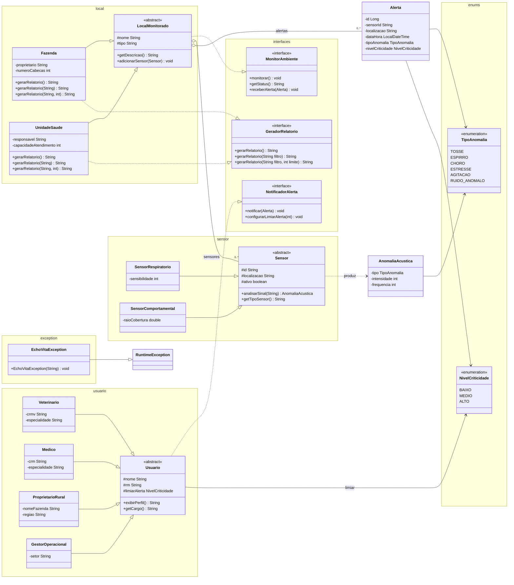

# EchoVita — Monitoramento Acústico Preventivo

Aplicação Java para a **Global Solution (GS) FIAP — 2ESPY 2026**, alinhada ao **ODS 9 — Indústria, Inovação e Infraestrutura**. Monitora ambientes rurais e de saúde por meio de sensores acústicos, detecta anomalias sonoras, gera alertas por criticidade e notifica perfis operacionais conforme limiar configurado.

Sem framework e sem gerenciador de dependências — apenas Java puro com **console (Scanner)** e **interface gráfica (Swing)**.

## Integrantes

- Beatriz Cortez — RM561431
- Bruno Alves — RM563986
- Davi de Jesus — RM566316
- Gabriel Augusto — RM564126
- Raphaela — RM572059

## Arquitetura em camadas

```
br.com.echovita
├── Main.java                 → ponto de entrada (escolha GUI ou console)
├── application/              → orquestração dos fluxos
│   ├── EchoVitaSystem        → fachada com dados demo e casos de uso
│   ├── EchoVitaLog           → logging centralizado
│   └── PreviaNotificacao     → DTO de prévia de notificações
├── console/                  → interação via terminal (Scanner)
│   ├── MenuConsole           → loop do menu e roteamento
│   ├── ConsoleMenuHandler    → ações de cada opção do menu
│   └── ConsoleInput          → leitura e validação de entrada
├── gui/                      → interface gráfica (Swing)
│   └── EchoVitaFrame         → janela principal com combos, botões e relatórios
├── domain/                   → modelo de domínio
│   ├── alerta/
│   │   ├── Alerta            → alerta preventivo com criticidade
│   │   └── AnomaliaAcustica  → resultado da análise de sinal
│   ├── enums/
│   │   ├── TipoAnomalia      → tosse, estresse, ruído anômalo, etc.
│   │   └── NivelCriticidade  → baixo, médio, alto
│   ├── exception/
│   │   └── EchoVitaException → exceção de regras de negócio
│   ├── interfaces/
│   │   ├── GeradorRelatorio  → relatórios com filtro e limite (sobrecarga)
│   │   ├── MonitorAmbiente   → monitoramento e recebimento de alertas
│   │   └── NotificadorAlerta → notificação e limiar de alerta
│   ├── local/
│   │   ├── LocalMonitorado   → classe abstrata (herança)
│   │   ├── Fazenda           → ambiente rural / saúde animal
│   │   └── UnidadeSaude      → clínica ou unidade pública
│   ├── sensor/
│   │   ├── Sensor            → classe abstrata (herança)
│   │   ├── SensorRespiratorio
│   │   └── SensorComportamental
│   └── usuario/
│       ├── Usuario           → classe abstrata (herança)
│       ├── Veterinario
│       ├── Medico
│       ├── ProprietarioRural
│       └── GestorOperacional
└── resources/images/         → imagens para GUI (locais e usuários)
```

### Responsabilidades

| Pacote | Responsabilidade |
|--------|------------------|
| `application` | Orquestra casos de uso, dados demo e logging |
| `console` | Menu interativo, leitura de entrada e exibição de saída |
| `gui` | Interface Swing com monitoramento, alertas, notificações e relatórios |
| `domain.alerta` | Representação de anomalias detectadas e alertas gerados |
| `domain.enums` | Tipos de anomalia acústica e níveis de criticidade |
| `domain.exception` | Exceções de validação e regras de negócio |
| `domain.interfaces` | Contratos de monitoramento, relatório e notificação |
| `domain.local` | Ambientes monitorados, sensores associados e relatórios |
| `domain.sensor` | Captação e análise polimórfica de sinais sonoros |
| `domain.usuario` | Perfis que recebem alertas conforme limiar configurado |

## Diagrama de classes



## Java (SDKMAN)

O arquivo [`.sdkmanrc`](.sdkmanrc) fixa o JDK deste projeto. Com [SDKMAN](https://sdkman.io/) instalado, na raiz do repositório:

```bash
sdk env
java -version
```

Se essa distribuição ainda não estiver instalada:

```bash
sdk install java 21.0.2-open
sdk env
```

Requisito: **Java 21.0.2-open**

## Como executar

```bash
sdk env
mkdir -p out
find src -name "*.java" -print0 | xargs -0 javac --release 21 -d out -encoding UTF-8
java -cp out br.com.echovita.Main
```

Ou abra o projeto na IDE com **source root** em `src` e execute `br.com.echovita.Main`.

Na inicialização, escolha **1** para interface gráfica (Swing) ou **2** para menu no console.

## Menu do sistema (console)

| Opção | Ação |
|------:|------|
| **1** | Listar locais monitorados |
| **2** | Exibir sensores de um local |
| **3** | Executar monitoramento |
| **4** | Exibir alertas de um local |
| **5** | Notificar usuário (com prévia e confirmação) |
| **6** | Gerar relatório (texto ou CSV) |
| **7** | Exibir perfil do usuário |
| **8** | Configurar limiar de alerta |
| **0** | Sair |

## Interface gráfica (Swing)

A GUI oferece combos para usuário, local e limiar, além de botões para monitorar, exibir alertas, notificar, gerar relatório, exportar CSV e exibir perfil com imagens dos locais e usuários.

## Estado atual

A aplicação está funcional com:

- Modelo de domínio completo (herança, interfaces, classes abstratas, enums)
- Orquestração via `EchoVitaSystem` com ambiente demo
- Menu interativo no console e interface gráfica Swing
- Monitoramento simulado, alertas, notificações por limiar e relatórios
- Sobrecarga de métodos em `GeradorRelatorio` (`gerarRelatorio()`, `gerarRelatorio(String)`, `gerarRelatorio(String, int)`)

## Recursos orientados a objetos

- **Entidades de domínio**: `Alerta`, `AnomaliaAcustica`, `LocalMonitorado` (abstrata), `Sensor` (abstrata) e `Usuario` (abstrata)
- **Herança e polimorfismo**: `Fazenda` e `UnidadeSaude` estendem `LocalMonitorado`; `SensorRespiratorio` e `SensorComportamental` estendem `Sensor` com `@Override` em `analisarSinal()` e `getTipoSensor()`
- **Perfis de usuário**: `Veterinario`, `Medico`, `ProprietarioRural` e `GestorOperacional` especializam `Usuario` com `exibirPerfil()` e `getCargo()`
- **Interfaces**: `MonitorAmbiente` ← `LocalMonitorado`; `GeradorRelatorio` ← `Fazenda` / `UnidadeSaude`; `NotificadorAlerta` ← `Usuario`
- **Sobrecarga de métodos**: `GeradorRelatorio` expõe três assinaturas de `gerarRelatorio` implementadas em `Fazenda` e `UnidadeSaude`
- **Enums**: `TipoAnomalia` e `NivelCriticidade` para classificação de eventos e priorização
- **Composição**: `LocalMonitorado` agrega listas de `Sensor` e `Alerta`; sensores produzem `AnomaliaAcustica` que alimentam a criação de `Alerta`

## Funcionalidades de negócio

- **Análise acústica**: sensores interpretam sinais sonoros e classificam o tipo de anomalia (ex.: tosse, estresse, agitação)
- **Alertas preventivos**: `Alerta` registra sensor, local, tipo de anomalia, criticidade e data/hora
- **Monitoramento de ambiente**: locais recebem alertas e expõem status conforme sensores cadastrados
- **Notificação por limiar**: usuários configuram criticidade mínima (`configurarLimiarAlerta`) antes de receber alertas
- **Relatórios**: `Fazenda` e `UnidadeSaude` geram relatórios completos, filtrados por texto ou limitados por quantidade

## Exemplo de fluxo

1. Instancie um ambiente monitorado (`Fazenda` ou `UnidadeSaude`)
2. Cadastre sensores (`SensorRespiratorio`, `SensorComportamental`) no local via `adicionarSensor`
3. Analise um sinal com `analisarSinal("tosse repetida")` ou `analisarSinal("estresse no curral")`
4. Crie um `Alerta` a partir da anomalia detectada e registre no local com `receberAlerta`
5. Notifique um perfil (`Veterinario`, `Medico`, etc.) com `notificar(alerta)` respeitando o limiar
6. Gere relatório do ambiente com `gerarRelatorio()`, `gerarRelatorio("tosse")` ou `gerarRelatorio("tosse", 5)`
